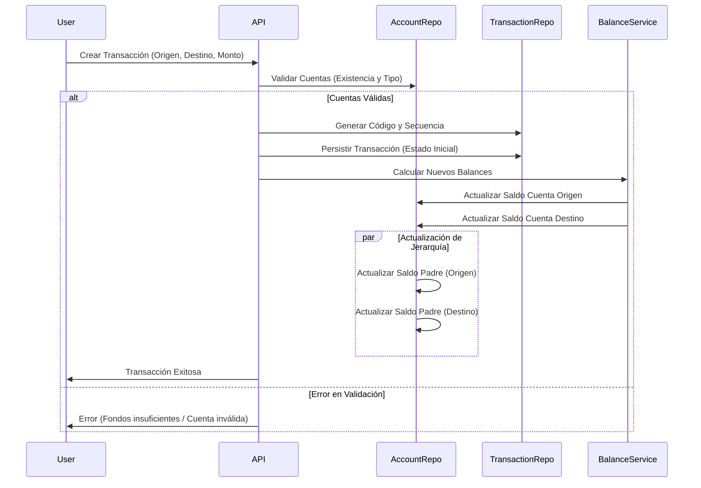
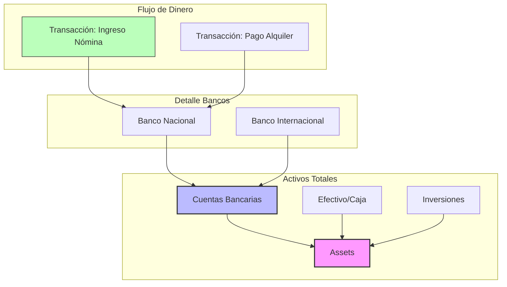

# Equity: Plataforma de Gestión Financiera Inteligente

Equity es una solución avanzada de gestión financiera diseñada para ofrecer un control total sobre las finanzas personales y familiares. A diferencia de los rastreadores de gastos convencionales, Equity se basa en principios de contabilidad de doble entrada, garantizando que cada céntimo esté contabilizado y que los balances sean siempre precisos.

El proyecto combina una arquitectura robusta con capacidades de Inteligencia Artificial para no solo registrar lo que sucede, sino explicar por qué sucede y cómo mejorar la salud financiera.

## Propuesta de Valor

*   **Precisión Contable**: Utiliza el sistema de doble entrada (partida doble) para asegurar que los activos y pasivos siempre cuadren.
*   **Visión Jerárquica**: Los balances se agregan automáticamente desde cuentas hijas a cuentas padre, permitiendo ver el panorama general o el detalle granular al instante.
*   **Inteligencia Financiera**: Módulos de IA integrados que analizan patrones de gasto y salud financiera.
*   **Privacidad y Control**: Diseñado para ejecutarse como aplicación de escritorio (Electron) o servicio web, manteniendo los datos bajo control del usuario.

## Funcionalidades Principales

### 1. Gestión Avanzada de Cuentas
El sistema permite crear una estructura de cuentas personalizada y jerárquica.
*   **Jerarquía Ilimitada**: Cree cuentas principales (ej. Bancos) y subcuentas (ej. Banco A, Banco B). Los saldos de las subcuentas actualizan automáticamente a la cuenta padre.
*   **Tipos de Cuenta**: Soporte completo para Activos, Pasivos, Ingresos y Gastos.
*   **Historial de Balances**: Registro automático de balances diarios y mensuales para análisis de tendencias.

### 2. Motor de Transacciones
El núcleo del sistema es un motor de transacciones robusto.
*   **Transacciones Simples y Divididas (Split)**: Registre un gasto único o divídalo en múltiples categorías en una sola operación.
*   **Reversión y Auditoría**: Capacidad para revertir transacciones manteniendo la integridad de los datos. Traceabilidad completa de cada movimiento.
*   **Validaciones de Integridad**: Reglas estrictas, como impedir transacciones directas sobre cuentas padre que tienen hijos, garantizando la consistencia de los datos agregados.

### 3. Salud Financiera (AI)
Equity va más allá del registro manual.
*   **Análisis Automático**: Algoritmos que evalúan la estabilidad financiera basándose en flujos de caja y ratios de deuda.
*   **Puntuación y Recomendaciones**: Generación de métricas de salud financiera personalizadas.

### 4. Reportes y Planificación
*   **Dashboard Interactivo**: Visualización en tiempo real de activos netos, liquidez y deuda.
*   **Reportes Históricos**: Comparativas mensuales y anuales.
*   **Planificación Financiera**: Herramientas para proyectar y planificar objetivos futuros.

## Flujos de Proceso

### Flujo de Creación de Transacción
Este diagrama ilustra cómo el sistema asegura la integridad de los datos cada vez que se registra un movimiento.

### Agregación de Saldos (Jerarquía de Cuentas)
Cómo los saldos fluyen desde las cuentas operativas hacia las categorías principales.

## Arquitectura del Proyecto

El sistema está construido siguiendo una arquitectura limpia y modular:

*   **API (Backend)**: NestJS con TypeScript. Gestiona la lógica de negocio, persistencia (MongoDB) y seguridad.
*   **Web (Frontend)**: Vue 3. Interfaz reactiva y moderna.
*   **Electron**: Empaquetado de la aplicación para ejecución nativa en escritorio.
*   **Infraestructura**: Dockerizado para fácil despliegue y desarrollo.
